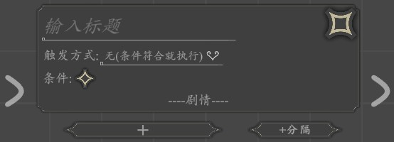
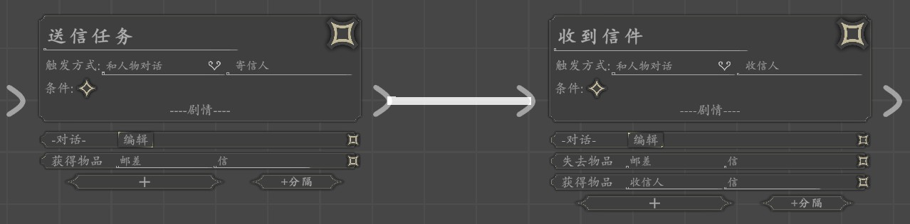
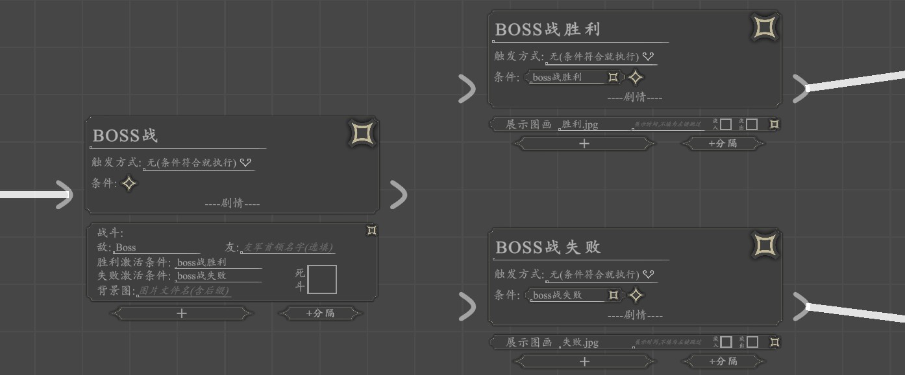
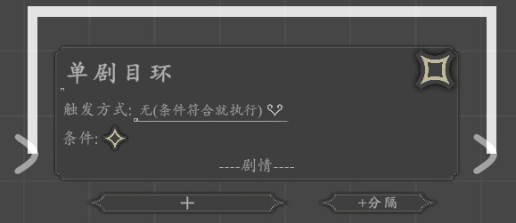
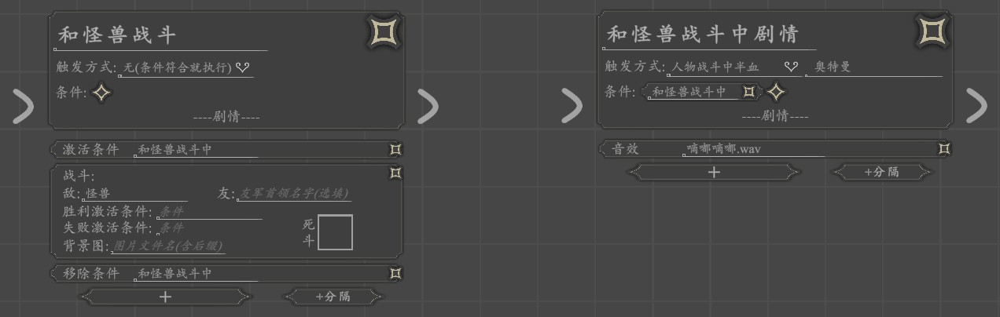

# 剧目

游戏剧情由剧目组成，剧目包含
- [触发时机](#触发时机)
- [条件](#条件)
- [剧情元素](./act-element.html)

## 触发时机
触发时机游戏中是触发剧目剧情所需的时机，包括：
- `游戏开始`： 玩家初次进入游戏时触发
- `进入地点`： 玩家进入地点时触发
- `和人物对话`： 和人物对话时触发
- `无（条件符合就触发）`： 当剧目[条件](#条件)被全部被激活时触发
- `人物死亡`： 当人物死亡时触发，人物可在死斗模式的[战斗](./combat.html)中被杀死或被[剧情元素](./act-element.html)[杀死人物](./act-element.html#杀死人物)杀死
- `人物半血`： 当人物在[战斗](./combat.html)中损失50%血量时触发
- `战斗进行到N回合`： [战斗]进行到第N回合时触发

:::tip
剧目触发过一次后不会再次触发（[环形流程](#环形流程)除外）

人物半血和战斗进行到N回合往往需要搭配[条件](#条件)使用，见[战斗中剧情](#战斗中剧情)
:::

## 条件
- 剧目触发需满足的条件
- 条件可被[剧情元素](./act-element.html)：[激活条件](./act-element.html#激活条件)激活
- 已激活的条件可被[剧情元素](./act-element.html)：[移除条件](./act-element.html#激活条件)移除

### 例子
只有在BOSS战剧目中激活“主角杀死了BOSS”条件后才可触发杀死BOSS以后的各种剧情，比如路人会向主角欢呼，酒馆中的吟游诗人会歌颂主角。

### 概率条件
- 当在条件文本为--<数字>%--（例如--50%--, --33.3%--）时，该条件为概率条件。
- 剧目触发时有数字所对应的概率被满足（例如--50%--为条件有50%的概率满足）。
- 概率条件不使用[激活条件](./act-element.html#激活条件)，[移除条件](./act-element.html#激活条件)激活和移除。

## 剧情
- 此剧目触发后播放的剧情
- 由剧情元素队列组成，剧情元素包括人物对话，展示图片， 战斗等。详见[剧情元素](./act-element.html)
- 剧情元素由上往下依次播放，拖动可排序

### 创建剧情元素
- `点击剧情栏的“+”按钮`
- `选择要添加的剧情元素`
- `填入参数或点击编辑按钮进入编辑`

## 剧目优先级

当两个不同剧目的触发时机和条件同时被满足时，会触发优先级更高的剧目。
- 在单个[故事板分页](./storyboard.html#故事板分页)中，位置越高的剧目触发优先级越高。
- 如有多个[故事板分页](./storyboard.html#故事板分页)，分页位置越高，其中剧目的触发优先级越高。

## 剧目组合流程
多个剧目可以通过排列组合实现不同的剧情流程，包括
- [线性流程](#线性流程)
- [分叉流程](#分叉流程)
- [环形流程](#环形流程)

### 线性流程

- `拖动前置剧目右边的箭头">"，连接到后置剧目左边的箭头">"`
- 只有当前置剧目被触发后后置剧目才能被触发

### 分叉流程

- 通过激活不同条件实现剧情分叉

### 环形流程

- `拖动剧目右边的箭头">"，连接到剧目左边的箭头">"，组成单剧目环`
- `剧目连接多个剧情后再连接到自身左边的箭头">"，组成多剧目环`
- 环形流程会循环触发其中的剧目。
- 多剧目环必须有一个入口剧目（见图）。

## 特殊剧目用例

- [地图间传送](#地图间传送)
- [战斗中剧情](#战斗中剧情)
- [主角死亡处理](#主角死亡处理)

### 地点间传送

### 战斗中剧情

- 战斗中剧情往往需要在战斗前[激活条件](./act-element#激活条件), 战斗结束后[移除条件](./act-element#移除条件)来定位到具体的某场战斗

### 主角死亡处理

当主角死亡时，玩家在地图上的移动会被禁止。此时游戏作者需根据剧情需要提醒玩家游戏结束，或[切换主角](./act-element.html#切换主角)