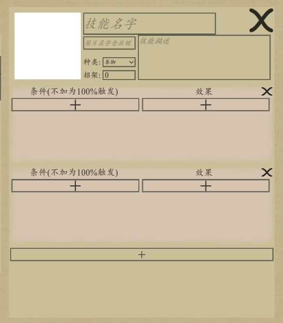

# 技能单元
技能单元由作用对象+多个效果单元组成，由上往下依次发动，拖动可排序。

## 对象
- 自身
- 单体
- 己方群体
- 己方群体（除自身）
- 敌方群体
- 全体
- 全体（除自身）
- 伤害来源（仅存在于受攻击时触发的被动）
- 伤害目标（仅存在于攻击时触发的被动）

::: tip
群体类目标可设置最大目标数，如最大目标数<目标群体人数则随机从目标群体中抽取=最大目标数的单位作为目标
:::

## 条件
条件决定了效果是否触发，如不满足则跳过此效果

|类型|参数|
| --- | ----------- |
|概率（独立）|触发的概率（小数），不填为0|
|概率（互斥）|触发的概率（小数），在此技能单元内，会于其他概率（互斥）条件互斥，例如：有50%互斥概率造成1伤害，50%互斥概率造成2伤害，则只会有两种结果，造成1伤害和造成2伤害|
|拥有被动|拥有的被动名字|
|护甲≥|护甲量|
|内力≥|内力量|

#### 对象
判定条件的对象，包括自身，目标

#### NOT选项
选择之后条件判断会反着来，比如拥有被动a将变为不拥有被动a

## 效果

|类型|参数|
| --- | ----------- |
|添加[技能](./spell.html)或[被动](./passive.html)|技能或被动名|
|失去[技能](./spell.html)或[被动](./passive.html)|技能或被动名|
|伤害|伤害量|
|抵近目标||
|轨迹特效|抛掷物图片名|
|打击特效||
|后撤||
|获得生命|生命量|
|获得生命上限|生命上限量|
|获得/消耗内力|内力量（可以为负数，表示消耗内力）|
|获得/失去护甲|护甲量（可以为负数，表示失去护甲）|
|召唤：召唤人物加入战斗|人物名|
|幻形：改变战斗中人物图片|图片文件名含后缀|
|停止幻形||
|获得武器|武器名|
|失去武器|武器名|
|失去某种种类的武器|武器种类名|
|夺刃||
|添加全体[结界](#添加结界)|结界提供的技能或被动名|
|添加己方[结界](#添加结界)|结界提供的技能或被动名|
|添加敌方[结界](#添加结界)|结界提供的技能或被动名|
|展示图片|图片文件名含后缀|
|停止展示图片|图片文件名含后缀|
|停顿|停顿时间（秒）|
|音效|音效文件名含后缀|
|震动相机||
|慢动作||
|添加战斗背景|图片文件名含后缀|
|移除战斗背景|图片文件名含后缀|

### 添加结界
添加结界会对结界中所有单位添加技能或被动，结界中之后登场的单位也会被添加该技能或被动

### 伤害类型
伤害类的技能效果可选择伤害类型
- 物理伤害：目标有护甲时会伤害护甲，无护甲时会伤害生命
- 内力伤害：无视目标的护甲
- 环境伤害：无视目标的护甲，也不会触发造成/受到伤害时触发的被动
### 轨迹特效，打击特效
粒子特效，其中轨迹特效可以添加抛射物的图片（可以自己制作导弹，飞刀之类的图片加上去）

## 例子

