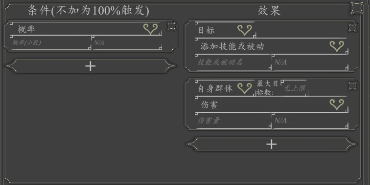

# 技能单元
由作用对象+多个效果单元组成，由上往下依次发动，拖动可排序。

## 作用对象
- 自身
- 己方前排
- 敌方前排
- 己方群体
- 敌方群体
- 伤害来源（仅存在于受攻击时触发的被动）
- 伤害目标（仅存在于攻击时触发的被动）

::: tip
自身群体和目标群体可设置最大目标数，如最大目标数<目标群体人数则随机从目标群体中抽取=最大目标数的单位作为目标
:::

## 效果单元
效果单元由条件和效果组合组成。

### 条件
条件决定了效果是否触发，如不满足则跳过此效果

|类型|参数|
| --- | ----------- |
|概率|触发的概率（小数），不填为0|
|拥有被动|拥有的被动名字|

### 效果

|类型|参数|
| --- | ----------- |
|添加[技能](./spell.html)或[被动](./passive.html)|技能或被动名|
|失去[技能](./spell.html)或[被动](./passive.html)|技能或被动名|
|伤害|伤害量|
|内力伤害（无视目标的护甲）|伤害量|
|等同护甲N倍的内力伤害|倍数|
|等同内力N倍的内力伤害|倍数|
|获得生命|生命量|
|真实伤害（无视目标的护甲，也不会触发受到伤害时触发的被动）|伤害量|
|消耗内力|内力量|
|获得内力|内力量|
|获得内力上限|内力上限量|
|获得护甲|护甲量|
|召唤：召唤人物加入战斗|人物名|
|幻形：改变战斗中人物图片|图片文件名含后缀|
|停止幻形||
|获得武器|武器名|
|失去武器|武器名|
|失去当前武器||
|夺刃||
|展示图片|图片文件名含后缀|
|停止展示图片|图片文件名含后缀|
|停顿|停顿时间（秒）|
|音效|音效文件名含后缀|
|添加战斗背景|图片文件名含后缀|
|移除战斗背景|图片文件名含后缀|

#### 攻击特效
当技能效果造成攻击时的特效，包括默认，炎，霜
